# Employee Leave Management System
##### Admin functionalities
* add new employees
* update details of existing employees
* set the numbers of days of each type of leave employees are allowed to take
* approve a leave that an employee applies for

##### Employee functionalities
* Login and View personal details
* view number of days he can apply for leave 
* apply for leave
* check the status of his/her leaves

                    Controller
                        |
                        ↓
                 EmployeeService
                        |
                 @Cacheable
                        |
                        ↓
               ┌─────────────────┐
               │ Caffeine Cache  │
               └─────────────────┘
                        |
                   Cache miss
                        |
                        ↓
                    Database

# Screenshots
 

    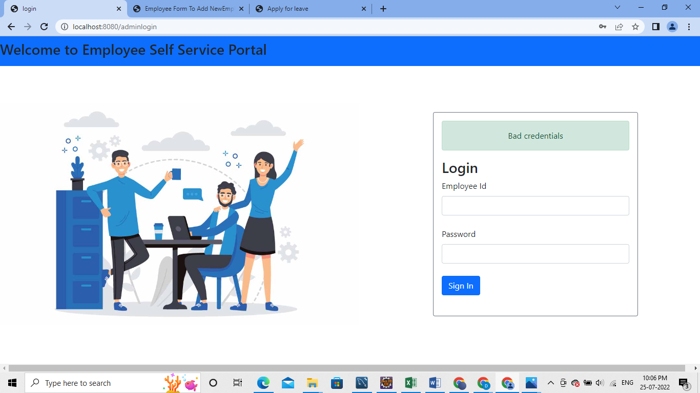
 

 
  
    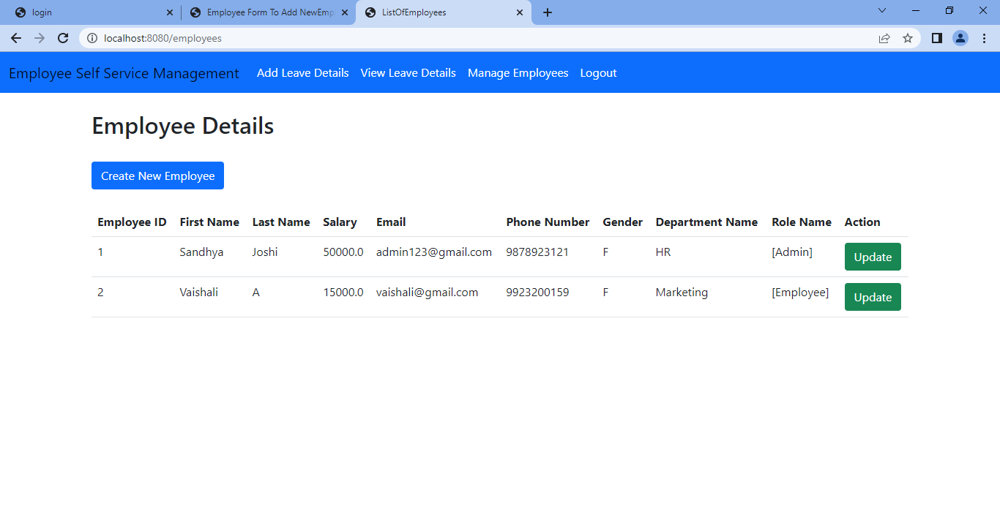
 
     
  
  
    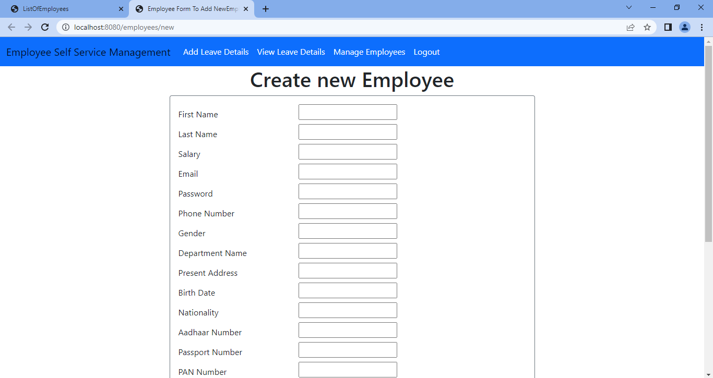
 
     
 
  
    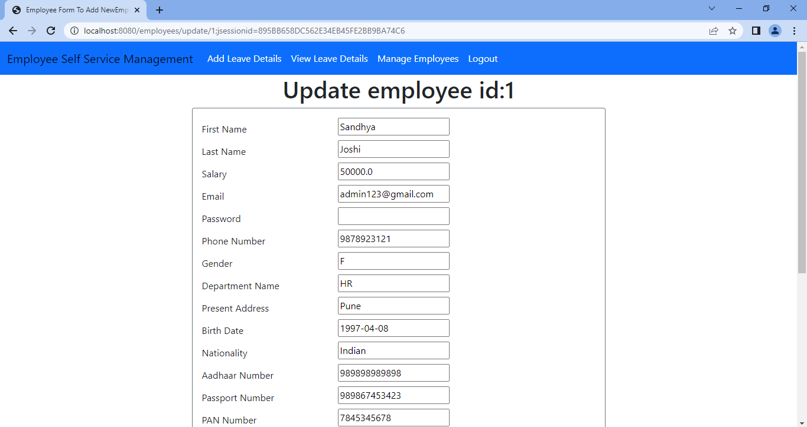
 
     
  
  
    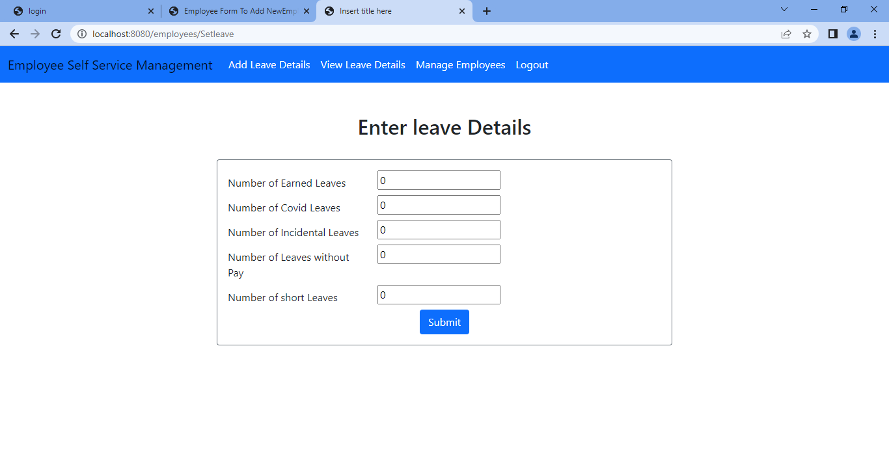
 
     
 
  
    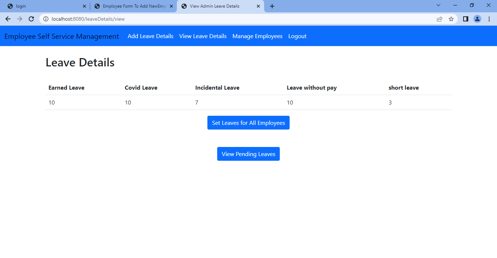
 
  

  
  
    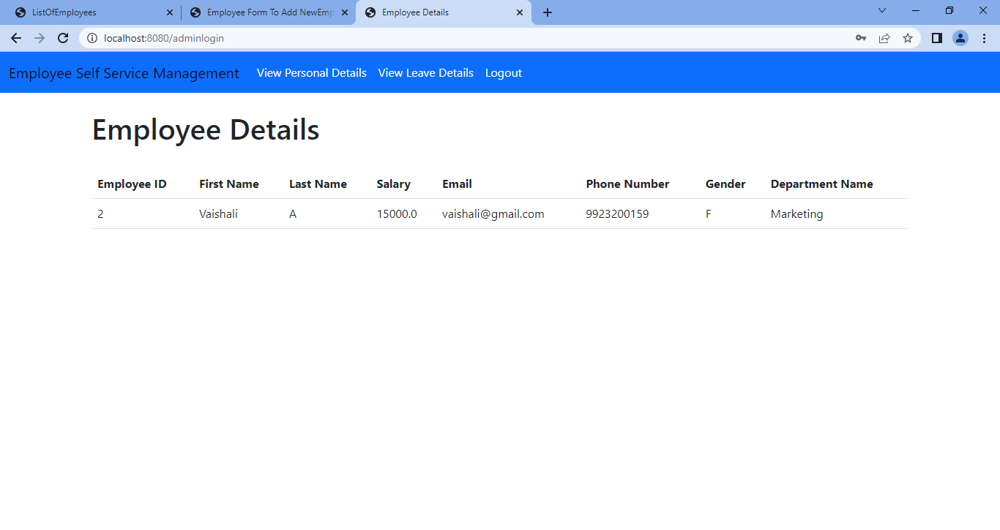
 
     
  
  
    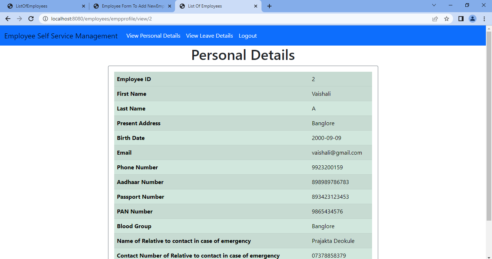
 
  
 
  
    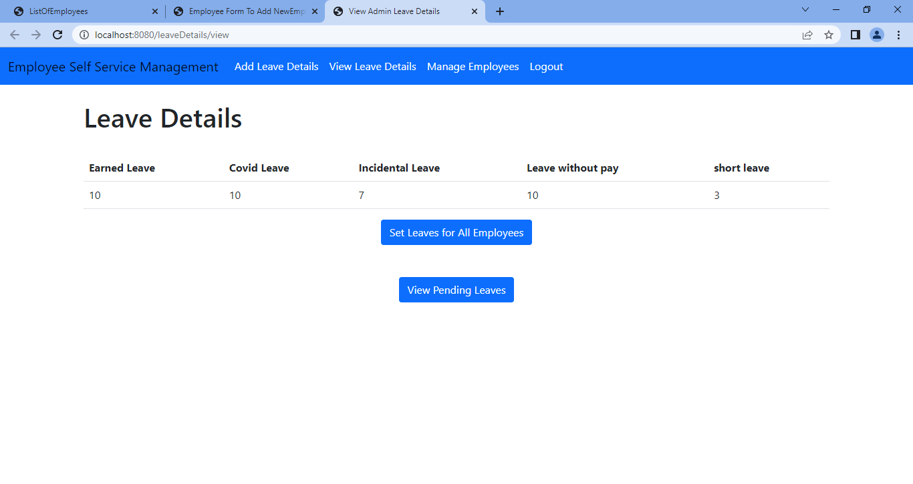
 
  

  
    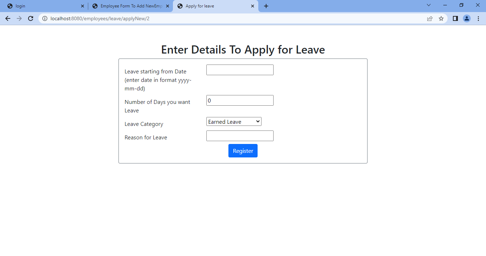
 
  
 
  
    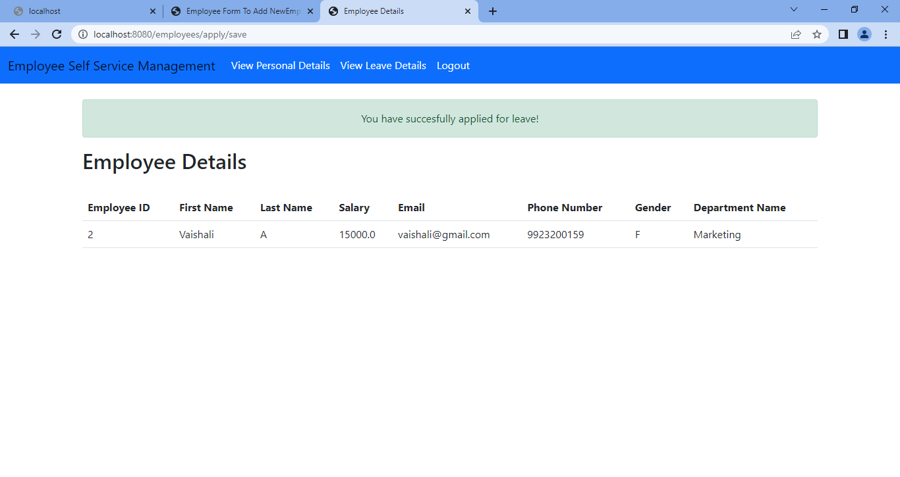
 
  
 

    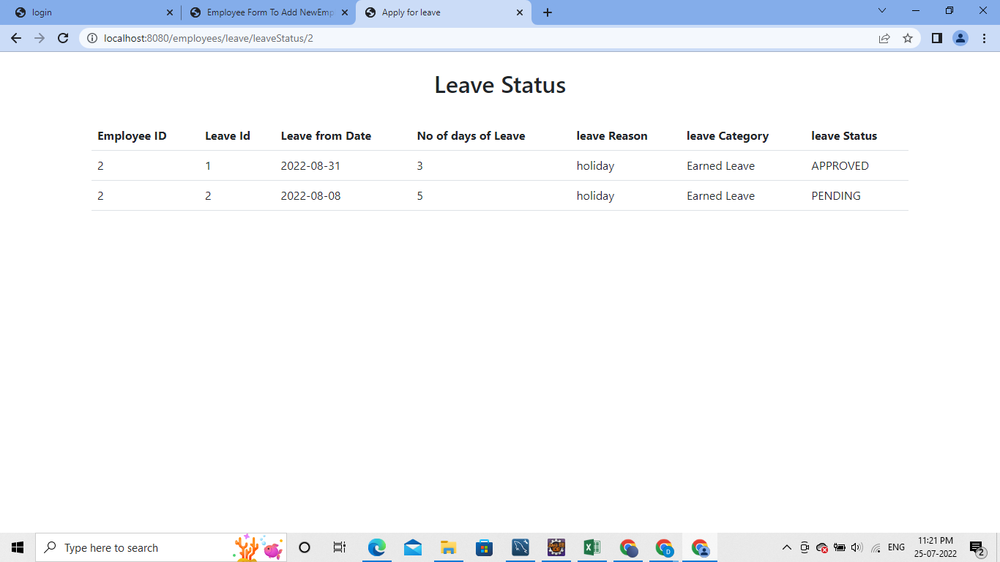
 

Keep the controller responsible for HTTP/UI handling and keep caching in the service layer. That's a much cleaner separation of concerns.

Also, because you're using a local in-memory Caffeine cache, remember that if you run multiple instances of this application, each instance gets its own cache. For a single-instance employee-management project, that's perfectly reasonable. For multiple application instances, you'd generally move toward a distributed cache such as Redis.

                         ┌─────────────────────┐
                         │   Controller Layer  │
                         ├─────────────────────┤
                         │ EmployeeController  │
                         │ LoginController     │
                         │ AdminController     │
                         └──────────┬──────────┘
                                    │
                                    ▼
                         ┌─────────────────────┐
                         │    Service Layer    │
                         ├─────────────────────┤
                         │ EmployeeService     │
                         │ LeaveService        │
                         │ LeaveEmployeeService│
                         │ employeeManagement.service.ApplyLeaveService   │
                         └──────────┬──────────┘
                                    │
                    ┌───────────────┴───────────────┐
                    │                               │
                    ▼                               ▼
          ┌──────────────────┐             ┌─────────────────┐
          │   Cache Layer    │             │ Repository Layer│
          ├──────────────────┤             ├─────────────────┤
          │ employees        │             │ EmployeeRepo    │
          │ roles            │             │ RoleRepo        │
          │ leaveInformation │             │ LeaveInfoRepo   │
          │ employeeLeave    │             │ LeaveEmployeeRepo│
          │ employeeLeaves   │             │ ApplyLeaveRepo  │
          │ applyLeaveById   │             └────────┬────────┘
          └──────────────────┘                      │
                                                    ▼
                                           ┌─────────────────┐
                                           │     Database    │
                                           └─────────────────┘

| Service                                          | Cache name         | Cache key      |
| ------------------------------------------------ | ------------------ | -------------- |
| `EmployeeService.findEmployeeById()`             | `employees`        | employee ID    |
| `EmployeeService.saveEmployee()`                 | `employees`        | `employeeId`   |
| `EmployeeService.getRoles()`                     | `roles`            | `"all"`        |
| `LeaveService.getLeaveDetailsById()`             | `leaveInformation` | leave ID       |
| `LeaveService.saveLeaveDetails()`                | `leaveInformation` | saved leave ID |
| `LeaveEmployeeService.getEmployeeLeaveDetails()` | `employeeLeave`    | employee ID    |
| `LeaveEmployeeService.saveLeaveInfo()`           | `employeeLeave`    | employee ID    |
| `employeeManagement.service.ApplyLeaveService.findLeaveForEmployeeId()`     | `employeeLeaves`   | employee ID    |
| `employeeManagement.service.ApplyLeaveService.getLeaveByLeaveId()`          | `applyLeaveById`   | leave ID       |
| `employeeManagement.service.ApplyLeaveService.saveEmployeeLeave()`          | `applyLeaveById`   | leave ID       |
