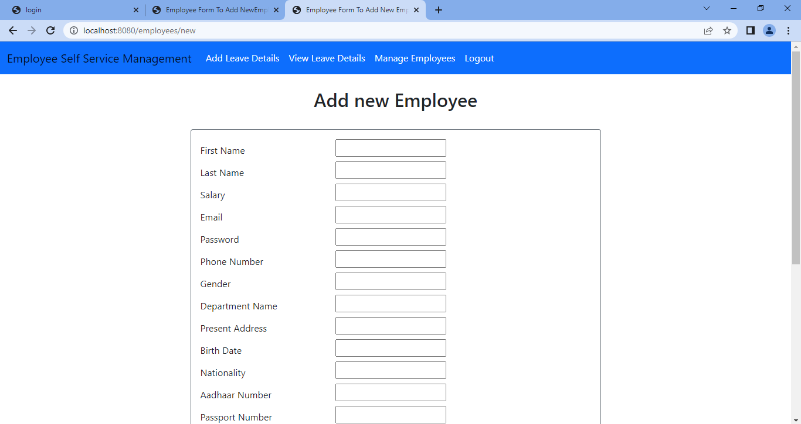
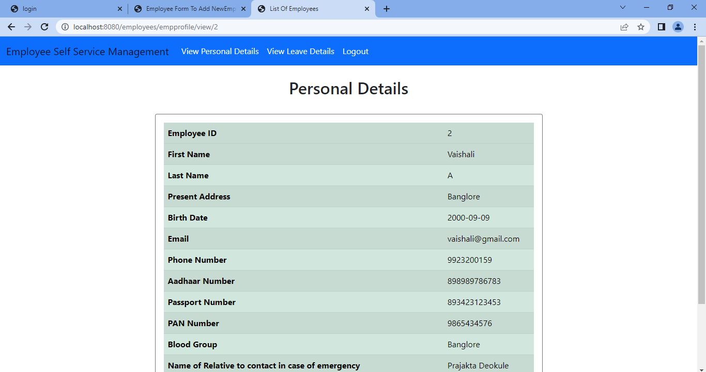
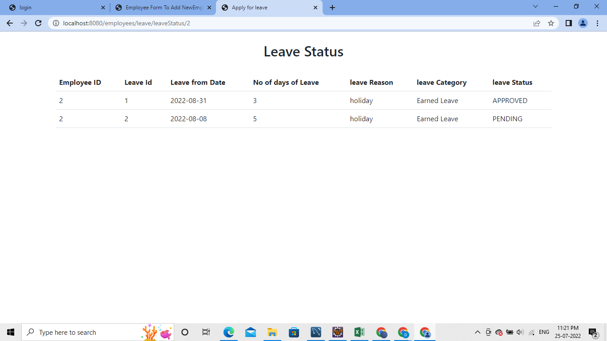

# Employee Leave Management System
##### Admin functionalities
* add new employees
* update details of existing employees
* set the numbers of days of each type of leave employees are allowed to take
* approve a leave that an employee applies for

##### Employee functionalities
* Login and View personal details
* view number of days he can apply for leave 
* apply for leave
* check the status of his/her leaves

# Screenshots
 

    
 

 
  
    
 
     
  
  
    
 
     
 
  
    
 
     
  
  
    
 
     
 
  
    
 
  

  
  
    
 
     
  
  
    
 
  
 
  
    
 
  

  
    
 
  
 
  
    
 
  
 

    
 

